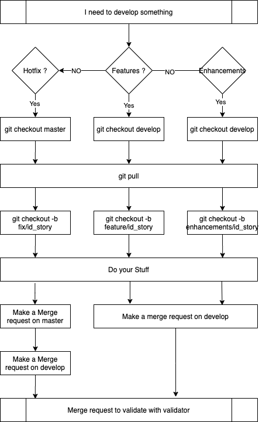
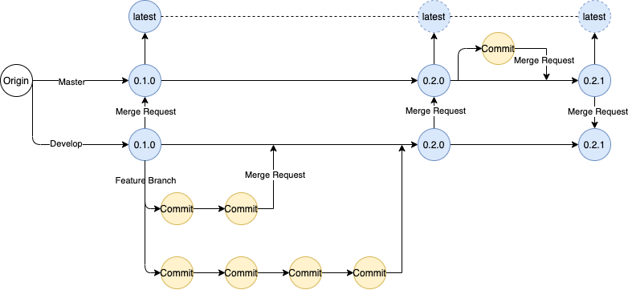

# Cookbooks for Artifakt

### How can I contribute?


The feature branch are define on develop. The production branch is master.

In this mode you have  develop with the full history of any change on the repository and master with a compact versioning of code. The master branch is used only to deliver the code at client. 

When you wish provide a feature/enhancements/hotfix  you need to follow this workflow:



In this repository, the following gitflow is in process:



All the tag must be immutable with the exception of the latest Tag.

#### Taging Rules:

The tag must follow the [semver](https://semver.org/) syntaxe. The semver notation is split in three part : X.Y.Z. 

* X represent all major version. Exemple: add a new technical stack or new service definition.
* Y represent all minor version. Exemple: edit an existing service and you upgrade an existing services.
* Z represent all security or hotfix patch. Exemple: an update break the deployement process or represente a security breach.

#### Production guide:

When you develop a new cookbook, you need to follow this processus:

1. Create a new folder structure

When you develop a nex cookbooks you need to create the following structure:

```bash
artifakt_service
    |- attributes
    |- recipes
    metadata.rb
```
The artifakt_service must be in the root of the code. the keyword service is used to define the cookbooks name. It must be representative of the usefulness of the cookbooks. The service keyword can be set like a technologie (docker/varnish) or set like a application (app_magento/app/drupal)

The attributes folder contain one file, default.rb. this file contains the default value used on this cookbooks.

The recipes folder contains the cookbooks definitions. 

> Install.rb

The recipe must be contain a intall.rb and must begin with the following information: 

```ruby
#
# Cookbook Name: artifakt_docker
# Recipe: install
#

display_title do
    title 'Installation of docker'
  end
```

The Display title is an informational label. It's printed during the execution of cookbooks.

This file contain the installation procedure of the service or application.

```ruby


  bash 'Configure Docker' do
      code <<-EOH
      yum update
      yum install docker -y
      usermod -a -G docker ec2-user
      service docker start
      chkconfig docker on
      EOH
  end

  display_title do
    title 'Installation of docker-composer 1.25.5'
  end

  bash 'name' do
      code <<-EOH
      curl -L https://github.com/docker/compose/releases/download/1.25.5/docker-compose-`uname -s`-`uname -m` | sudo tee /usr/local/bin/docker-compose > /dev/null
      chmod +x /usr/local/bin/docker-compose
      mv /usr/local/bin/docker-compose /usr/bin/docker-compose
      EOH
  end
```

> metadata.rb

This file contains the cookbook definition:

```ruby
name        "artifakt_docker"
description "Artifakt docker Recipes"
maintainer  "Artifakt"
license     "Apache 2.0"
version     "1.0.0"

recipe "artifakt_docker::install", "Setup docker"
```

All the first keyword are mandatory and all the recipe must be declare with the keyword
> recipe "cookbookname::recipename","descritption"

2. Add the recipe definition

All the cookbook must define in the current flow. When you add a cookbook, it's necessary to add the entry of the cookbook like this :

If you add a setup step:
> artifakt/recipes/setup.rb
If you add a deploy step:
> artifakt/recipes/deploy.rb
```ruby
include_recipe 'artifakt_docker::install'
```

> artifakt/metadata.rb
```ruby
depends "artifakt_docker"
```
3. Create the cookbooks

When you create a cookbooks, don't forget to use the builtin method by chef or opsworks. Please use all the function already define.

4. Test your cookbooks

When you ended to add your stuff, you need to test in realtime and real condition the cookbook. Go to console.artifakt.io and create a new environnement which matching with your branch. test and improve your edition and when you are sure to ended your modification, made your last commit.


5. Let's the CI made its stuff

When all your stuff ended, the CI must check all your stuff. If you add a cookbook, you must add your testing purpose. **This CI is currently in working progress.**